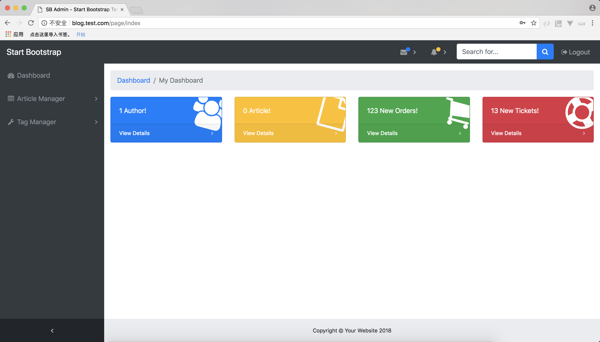
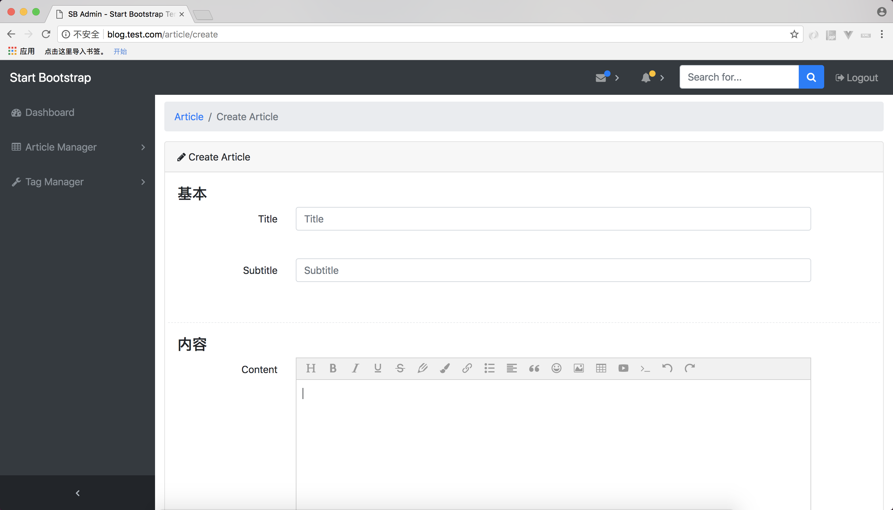
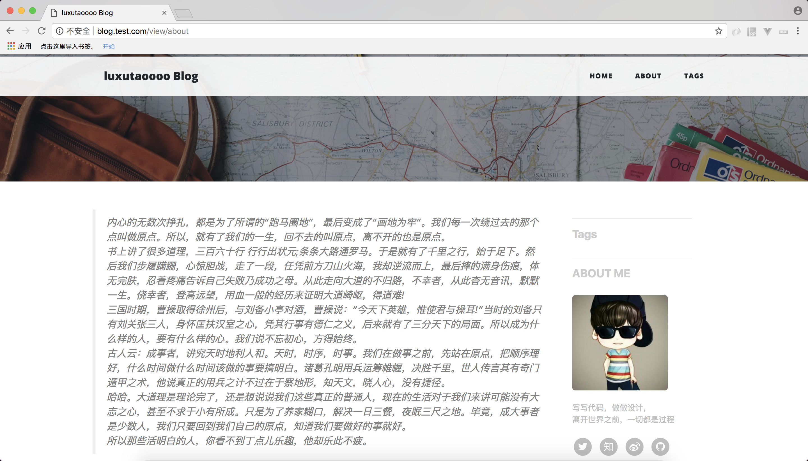

### CodeIgniter Blog

1. 创建数据库  
`CREATE DATABASE `blog` DEFAULT CHARACTER SET utf8 COLLATE utf8_general_ci;`
2. 初始化sql数据创建表  
`mysql -uroot < data.sql`
3. 配置nginx  
4. 绑定hosts访问http://blog.test.com/user/login

